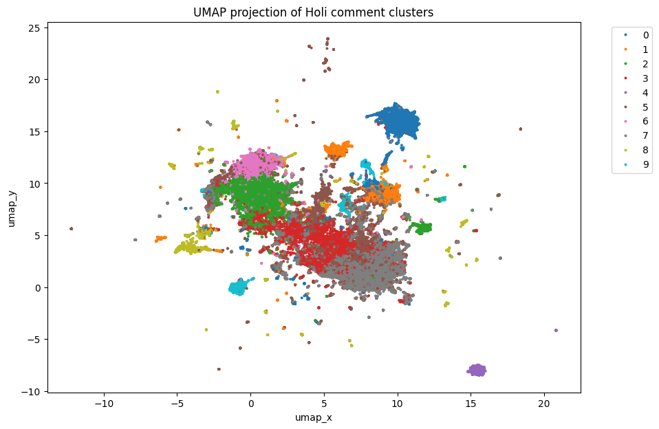

# Bhojpuiri Song YouTube Comments Analysis

## Abstract

This study analyzes 250,000 randomly sampled YouTube comments from Bhojpuri songs to uncover audience behavior, sentiment, and cultural patterns. Using natural language processing (NLP) techniques and clustering, we identify recurring discussion themes and fan engagement patterns. Our results show strong artist-based fandoms, Actors expressions, and lyrical conversations.

## Introduction

Bhojpuri songs have gained massive popularity on YouTube, frequently ranking among the top-viewed regional music videos. These songs are known for their bold lyrics, energetic beats, and vibrant performances that resonate strongly with audiences, particularly in North India. The genre has cultivated a large and active fanbase, driven by celebrated singers such as Pawan Singh and Khesari Lal Yadav, and popular tracks like Palang Sagwan Ke and many others.

Despite their popularity, Bhojpuri songs often face criticism for containing provocative and sometimes controversial content. The actresses’ performances and the lyrical themes are frequently considered vulgar or explicit, attracting debates about morality and cultural values. Nonetheless, these characteristics contribute to the fan engagement dynamics, where discussions around artists, lyrics, and cinematic expressions dominate the online discourse.

In this study, we analyze 250,000 randomly sampled YouTube comments on Bhojpuri songs using Natural Language Processing (NLP) and clustering techniques to explore audience behavior, sentiment, and cultural patterns. We particularly focus on how fandom, lyrical interpretations, and expressions about actors shape the conversation around Bhojpuri music in the digital space.

## Data Knowledge

This study is based on **YouTube comments collected from Bhojpuri songs**.  
The dataset includes multiple videos from different artists.

### Dataset Composition

- **Total comments collected:** 500,000+
- **Random sample analyzed:** 250,000 comments

### Video-wise Distribution

Below is a table of video-level statistics.

| Video Title               | Artist Name                        | Year | Comments Collected | Views (approx.) |
| ------------------------- | ---------------------------------- | ---- | ------------------ | --------------- |
| Sadiya                    | Pawan Singh Ft. Shivani Singh      | 2024 | 20000              | 294979306       |
| Dadhiya Badhiya Lagela    | Khesari Lal Yadav Ft. Yamini Singh | 2022 | 18687              | 209173649       |
| लागेलु जहर (Lagelu Jahar) | Shilpi Raj, Khesari Lal Yadav      | 2023 | 20000              | 110252402       |
| Saree Se Tadi             | Shilpi Raj Ft Smrity Sinha         | 2022 | 20000              | 201942287       |

### Insights

- Male Artist dominates comment volume with ~30% of the dataset.
- Female Artists and Actresses are often objectified in the community.
- Only Video **Saree Se Tadi** was having only female Characters and was dominated in the views.
- Mostly every Comments was the praising whether it be male or Female, since the community is male dominated, viewers often praise Pawan Singh and Khesari Lal Yadav.

## 🚀 How to Run the Project

This project processes and analyzes Bhojpuri YouTube comments in a multi-stage pipeline, from scraping to advanced clustering and visualization. Below are the key components and their purpose:

---

### 🔧 File 1: `1.py` — YouTube Data Collection

- **What it does:**
  Uses the YouTube Data API to collect metadata and comments from specified video URLs.
- **Details:**

  - Fetches video details: title, channel, views, likes, artist, theme.
  - Scrapes up to 60,000 comments per video.
  - Saves per-video data as JSON files in the `holi/` folder.

---

### 🔧 File 2: `2.py` — Data Merging

- **What it does:**
  Merges all individual video JSON files from the `holi/` folder into a single JSON file (`merged_songs.json`).
- **Details:**

  - Simplifies downstream processing.
  - Prepares a consolidated data source for flattening and cleaning.

---

### 🔧 File 3: `3.py` — Flatten & Initial Filtering

- **What it does:**
  Converts the merged JSON structure into a tabular CSV (`filtered_comments.csv`).
- **Details:**

  - Removes very short comments (<3 words).
  - Cleans punctuation and normalizes whitespace.
  - Ensures minimal word count to retain meaningful comments.

---

### 🔧 File 4: `4.py` — Local Cleaning & Sampling

- **What it does:**
  Performs advanced cleaning (emoji removal, stopword filtering, script detection).
- **Details:**

  - Detects script type (Devanagari, Latin, Mixed).
  - Removes duplicates and non-informative comments.
  - Samples \~200k clean comments for analysis in Colab.

---

### 🧱 File 5: `bhojpuri.ipynb` — Analysis Pipeline (Embeddings → Clustering → Visualization)

- **What it does:**
  Performs the full analysis pipeline:

  1. Generates embeddings using `all-mpnet-base-v2`.
  2. Runs dimensionality reduction (UMAP).
  3. Applies KMeans clustering.
  4. Generates LDA topic modeling per cluster.
  5. Performs Sentiment & Emotion Analysis.
  6. Visualizes clusters (UMAP + Bokeh interactive plot).
  7. Calculates Elbow and Silhouette scores.

- **Details:**
  All intermediate results are saved to allow easy reproducibility and further analysis.

---

### 📊 File 6: `try.py` — Video-Level Insights

- **What it does:**
  Identifies the highest performing videos based on **likes and views**.
- **Details:**

  - Produces a summary CSV with the most liked and viewed videos.
  - Provides actionable insights on fan engagement vs popularity.

---

This process enables seamless data flow from raw YouTube scraping to in-depth comment analysis and visualization.

## Methodology

### Step 1 — Data Source

We collected **370,000 comments** from Bhojpuri Holi song videos using a custom YouTube scraper. The dataset includes:

- `video_id`, `url`, `title`, `channel`, `artist`, `year`, `theme`, `views`, `likes`, `comment`, `word_count`.

### Step 2 — Filtering & Sampling

- Removed comments with fewer than 2 words.
- Language detection ensured Hindi/Bhojpuri or English comments.
- Random sampling to **100,000 comments** to ensure diversity across videos.
- **What:** Removed URLs, emojis, stopwords, very short words (<2 letters).
- **Why:** Noise (e.g., links, emojis, fillers) can distort embeddings and clustering.
- **Impact:** Cleaner text ensures that clusters represent **meaningful discussion themes** rather than junk tokens.

```python
from langdetect import detect
import pandas as pd
import random

df = pd.read_csv("filtered_comments.csv")
df = df[df['comment'].str.split().str.len() >= 2]
df = df[df['comment'].apply(lambda x: detect(x) in ['hi', 'en'])]
df_sample = df.sample(n=100000, random_state=42)
```

### Step 3 — Embeddings

We used the `all-mpnet-base-v2` SentenceTransformer model to generate vector embeddings for each comment.

- **What:** Transformed comments into dense vectors using `all-mpnet-base-v2`.
- **Why:** Embeddings capture **semantic meaning**, not just surface words, allowing similar comments to cluster together even if phrased differently.
- **Impact:** Enables discovery of latent themes (e.g., fandom, festival greetings) beyond simple keyword matching.

```python
from sentence_transformers import SentenceTransformer

model = SentenceTransformer('all-mpnet-base-v2')
embeddings = model.encode(df_sample['cleaned_comment'].tolist(), batch_size=64, convert_to_numpy=True)
```

### Step 4 — Clustering

We applied **UMAP** for dimensionality reduction followed by **KMeans** clustering (`k=10`) based on heuristic optimization.

- **What:** Reduced embeddings with UMAP, applied KMeans clustering (`k=10`).
- **Why:** Grouping comments into clusters allows us to see **audience sub-communities** (e.g., Pawan Singh fans, Holi greetings, nostalgia).
- **Impact:** Provides structure to otherwise unorganized comment space, forming the basis for thematic analysis.

```python
import umap.umap_ as umap
from sklearn.cluster import KMeans

umap_model = umap.UMAP(n_neighbors=15, n_components=5, metric='cosine', random_state=42)
emb_reduced = umap_model.fit_transform(embeddings)

kmeans = KMeans(n_clusters=10, random_state=42)
df_sample['cluster'] = kmeans.fit_predict(embeddings)
```

### Step 5 — Topic Modeling

For each cluster, we extracted the most frequent keywords to label them meaningfully.

- **What:** Extracted cluster-specific keywords (frequency + LDA).
- **Why:** Keywords reveal the **defining theme** of each cluster.
- **Impact:** Human-readable names (“Festive Spirit,” “Artist Fandom”) make clusters interpretable.

### Step 6 — Sentiment & Emotion Analysis

We used pre-trained transformer models (`distilbert-base-uncased-finetuned-sst-2-english` and `j-hartmann/emotion-english-distilroberta-base`) to annotate each comment with sentiment polarity and emotion.

- **What:** Applied pretrained transformers for sentiment (positive/negative) and emotion (joy, sadness, anger, etc.).
- **Why:** Goes beyond _what_ people talk about, capturing _how_ they feel about it.
- **Impact:** Adds emotional granularity, showing whether clusters reflect admiration, nostalgia, or critique.

### Step 7 — Visualization

A **UMAP 2D scatter plot** was created to visualize the clusters.

- **What:** Plotted embeddings in 2D using UMAP with cluster color-coding.
- **Why:** Visual maps highlight overlaps (shared themes) and separations (distinct fandoms).
- **Impact:** Provides an intuitive way to communicate results to non-technical audiences.

<!--  -->



## Results

The clustering produced **10 distinct groups** of conversations, representing various fandoms, cultural expressions, and engagement patterns.

## Discussion — Theme-wise Overview

| Cluster | Theme                                 | Interpretation                                                                |
| ------- | ------------------------------------- | ----------------------------------------------------------------------------- |
| **0**   | **Fan Anticipation & Milestones**     | Comments about “million views,” upcoming releases, excitement for milestones. |
| **1**   | **Generic Positive Reactions**        | “Super,” “nice,” “hit” — standard appreciation for music/videos.              |
| **2**   | **Khesari Fans**                      | Strong fandom for Bhojpuri star Khesari Lal Yadav.                            |
| **3**   | **Mixed Pawan Singh & Khesari Fans**  | Crossover chatter between Pawan Singh and Khesari fans.                       |
| **4**   | **Holi Festive Spirit**               | Holi-specific joy, greetings, and festival mentions.                          |
| **5**   | **Pawan Singh Star Power**            | Pawan Singh-centric fan pride and star mentions.                              |
| **6**   | **Conversational Chatter / Replies**  | Short banter, conversational replies, casual tone.                            |
| **7**   | **Year-based Nostalgia / References** | Mentions of specific years like 2025, 2024, 2022 — nostalgia.                 |
| **8**   | **Native Script Comments**            | Hindi/Bhojpuri script heavy — indicates native engagement.                    |
| **9**   | **Trending & Popularity Chatter**     | Talks about trending status, rankings, and view counts.                       |

## Conclusion

The UMAP visualization shows:

- **Overlapping Clusters**: Clusters 2, 3, and 5 overlap, suggesting strong interconnected artist fandoms.
- **Isolated Clusters**: Cluster 8 (native script) and Cluster 7 (year nostalgia) are visually separate — representing niche groups.
- **Cultural Indicators**: Holi greetings (Cluster 4) form a vibrant thematic hub, distinct from artist-specific clusters.
- **Engagement Patterns**: Popularity-based discussions (Cluster 0 and 9) show high engagement spikes during early song releases.

This thematic mapping can inform cultural research, targeted fan engagement, and regional content strategies.

### Calculated the score of the K (Elbow and Silhoutte)

Based on 10k random sample of the complete embeddings.

- **Silhoutte Score** : .png>)

- **Elbow Method** : .png>)
